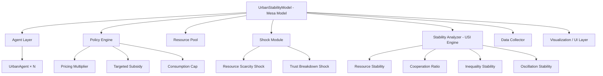
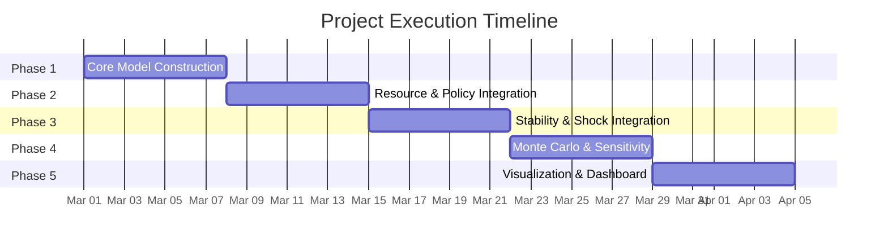

# 📋 Execution Plan
## Multi-Agent Framework for Urban Socio-Economic Stability Evaluation (Mesa-Based)

---

## 1. Project Overview

This execution plan outlines the phased development of an **Agent-Based Model (ABM)** using the **Mesa framework** to simulate and evaluate urban socio-economic stability. The model will simulate heterogeneous urban households interacting over shared resources under configurable policies and external shocks, producing a composite **Urban Stability Index (USI)**.

> [!IMPORTANT]
> All development follows a **discrete-time, Monte Carlo simulation methodology** with `N` agents, `T` time steps, and `R` independent runs per scenario.

---

## 2. Technology Stack

| Layer | Technology | Purpose |
|---|---|---|
| **Core Framework** | Mesa (Python ABM) | Agent scheduling, model orchestration |
| **Language** | Python 3.10+ | Primary development language |
| **Numerical** | NumPy | Distributions, array operations |
| **Data** | Pandas | Structured logging, CSV export |
| **Network** | NetworkX | Agent interaction graph |
| **Visualization** | Matplotlib / Plotly | Static & interactive plots |
| **Dashboard** | Streamlit | Interactive UI (Phase 5) |
| **Environment** | venv / conda | Dependency isolation |

---

## 3. System Architecture



---

## 4. Core Simulation Loop (Per Time Step)

```
1. Apply active policies (pricing, subsidy, cap)
2. Agents compute resource demand (based on income, price, trust)
3. Resource pool allocates resources (proportional if scarce)
4. Agents update trust (personal experience + neighbour influence)
5. Inject shock (if scheduled for this time step)
6. Compute stability metrics (Gini, cooperation ratio, USI)
7. Log all data via Mesa DataCollector
```

---

## 5. Phased Execution Plan

---

### 🔵 PHASE 1 — Core Model Construction

**Duration:** Week 1
**Objective:** Build a runnable baseline simulation without policies or shocks.

#### Tasks

| # | Task | Description | Priority |
|---|---|---|---|
| 1.1 | **Project Setup** | Create virtual environment, install Mesa, NumPy, Pandas, NetworkX, Matplotlib | 🔴 High |
| 1.2 | **Define `UrbanAgent` Class** | Implement agent with attributes: `unique_id`, `income` (lognormal), `trust` (uniform 0–1), `demand`, `allocated`, `cooperating` | 🔴 High |
| 1.3 | **Define `UrbanStabilityModel` Class** | Initialize model with `N` agents, Mesa `RandomActivation` scheduler, and a `DataCollector` | 🔴 High |
| 1.4 | **Implement Agent Step Logic** | Agents compute demand as `f(income, trust)` and update trust based on allocation fairness | 🔴 High |
| 1.5 | **Build Interaction Network** | Generate Erdős–Rényi graph (avg degree 6–10) using NetworkX; store adjacency list in model | 🟡 Medium |
| 1.6 | **Trust Propagation** | Agent trust = weighted average of personal experience + mean neighbour trust | 🟡 Medium |
| 1.7 | **Verify Execution** | Run 100 agents × 50 steps; confirm agents step correctly and data is logged | 🔴 High |

#### Key Implementation Details

- **Income distribution:** `np.random.lognormal(mean=10, sigma=1, size=N)`
- **Initial trust:** `np.random.uniform(0.3, 0.9, size=N)`
- **Demand formula:** `demand = income × trust × (1 / effective_price)`
- **Trust update:** `trust_new = α × personal_experience + (1 - α) × mean_neighbour_trust` where `α = 0.7`
- **Random seed:** Fixed at model level for reproducibility

#### Deliverable
✅ Basic simulation runs end-to-end without policies. Agents interact, demands are computed, trust updates propagate through the network.

---

### 🟢 PHASE 2 — Resource & Policy Integration

**Duration:** Week 2
**Objective:** Add resource allocation logic and three configurable policy mechanisms.

#### Tasks

| # | Task | Description | Priority |
|---|---|---|---|
| 2.1 | **Implement `ResourcePool`** | Track `total_supply` and `available_supply`; reset each step | 🔴 High |
| 2.2 | **Proportional Allocation** | If total demand > supply: `allocated_i = (demand_i / total_demand) × supply`. Otherwise: full allocation | 🔴 High |
| 2.3 | **Pricing Multiplier Policy** | Modify effective price: `effective_price = base_price × multiplier`. Apply before demand calculation | 🟡 Medium |
| 2.4 | **Targeted Subsidy Policy** | Bottom 30% income agents receive reduced effective price: `effective_price × (1 - subsidy_rate)` | 🟡 Medium |
| 2.5 | **Consumption Cap Policy** | Cap maximum allocation per agent: `allocated = min(allocated, cap_value)`. Apply after allocation | 🟡 Medium |
| 2.6 | **Policy Toggle System** | Store policy flags and parameters in model config dict; allow enabling/disabling per run | 🟡 Medium |
| 2.7 | **Validation** | Compare baseline (no policy) vs each policy; verify demand/allocation changes | 🔴 High |

#### Key Implementation Details

- **Allocation guard:** `allocated = max(0, allocated)` — prevent negative values
- **Variance logging:** Log `np.var(allocations)` each step
- **Supply reset:** `available_supply = total_supply` at start of each step
- **Policy config example:**
  ```python
  policy_config = {
      "pricing_multiplier": {"enabled": True, "value": 1.5},
      "subsidy": {"enabled": True, "rate": 0.3, "threshold_percentile": 30},
      "consumption_cap": {"enabled": False, "cap_value": 500}
  }
  ```

#### Deliverable
✅ Policy vs. no-policy comparison working. Resource allocation is fair, policies modify agent behavior as expected.

---

### 🟠 PHASE 3 — Stability Metrics & Shock Integration

**Duration:** Week 3
**Objective:** Implement the USI composite index, Gini coefficient, and configurable external shocks.

#### Tasks

| # | Task | Description | Priority |
|---|---|---|---|
| 3.1 | **Gini Coefficient** | Implement standard Gini over agent allocations per step | 🔴 High |
| 3.2 | **Resource Stability (S_R)** | `S_R = 1 / (1 + variance(allocations))` — normalized to [0, 1] | 🔴 High |
| 3.3 | **Cooperation Ratio (C)** | `C = mean(trust)` across all agents | 🔴 High |
| 3.4 | **Inequality Stability (S_I)** | `S_I = 1 - Gini` | 🔴 High |
| 3.5 | **Oscillation Stability (S_O)** | `S_O = 1 / (1 + var(USI_history[-W:]))` over sliding window `W` | 🟡 Medium |
| 3.6 | **USI Computation** | `USI(t) = w₁×S_R + w₂×C + w₃×S_I + w₄×S_O` with `Σwᵢ = 1` | 🔴 High |
| 3.7 | **Collapse Threshold** | Define collapse as `USI < 0.3` for 3+ consecutive steps | 🟡 Medium |
| 3.8 | **Resource Scarcity Shock** | At step `t_shock`: reduce `total_supply` by `shock_magnitude%` | 🔴 High |
| 3.9 | **Trust Breakdown Shock** | At step `t_shock`: reduce all agent trust by `shock_magnitude × trust` | 🟡 Medium |
| 3.10 | **Shock Configuration** | Configurable `t_shock`, `magnitude`, `type`, and `persistent` flag | 🟡 Medium |

#### USI Formula

```
USI(t) = 0.25 × S_R + 0.25 × C + 0.25 × S_I + 0.25 × S_O
```

> [!NOTE]
> Initial weights are equal (0.25 each). Sensitivity analysis in Phase 4 will explore alternate weightings.

#### Deliverable
✅ USI curve generated over time. Shocks visibly impact stability. Collapse detection functional.

---

### 🔴 PHASE 4 — Monte Carlo Runs & Sensitivity Analysis

**Duration:** Week 4
**Objective:** Run multiple independent simulations and perform systematic parameter sweeps.

#### Tasks

| # | Task | Description | Priority |
|---|---|---|---|
| 4.1 | **Monte Carlo Runner** | Execute `R` independent runs (default R=30) with different random seeds; store per-run results | 🔴 High |
| 4.2 | **Result Aggregation** | Compute mean, std, min, max USI across runs; plot confidence bands | 🔴 High |
| 4.3 | **Agent Count Sweep** | Test N ∈ {50, 100, 200, 500}; compare USI convergence | 🟡 Medium |
| 4.4 | **Shock Magnitude Sweep** | Test magnitude ∈ {0.1, 0.2, 0.3, 0.5, 0.7}; compare recovery patterns | 🟡 Medium |
| 4.5 | **Policy Effectiveness** | Compare USI under: no policy, pricing only, subsidy only, cap only, all combined | 🟡 Medium |
| 4.6 | **USI Weight Sensitivity** | Vary w₁–w₄ to assess metric dominance | 🟢 Low |
| 4.7 | **CSV Export** | Export all run data to CSV for external analysis and paper figures | 🔴 High |

#### Monte Carlo Output Structure

```
results/
├── run_001.csv         # Per-step data for run 1
├── run_002.csv
├── ...
├── summary.csv         # Aggregated metrics across all runs
└── plots/
    ├── usi_vs_time.png
    ├── gini_evolution.png
    └── cooperation_trend.png
```

#### Key Metrics to Store Per Run

| Metric | Type |
|---|---|
| Average USI | Scalar |
| Minimum USI | Scalar |
| Time to collapse (if any) | Scalar (step #) |
| USI time series | Array |
| Gini time series | Array |
| Cooperation time series | Array |

#### Deliverable
✅ Comparative plots across parameter sweeps. Statistical confidence in results. Publication-ready CSV data.

---

### 🟣 PHASE 5 — Visualization & Dashboard

**Duration:** Week 5
**Objective:** Build an interactive Streamlit dashboard for scenario exploration and a static report generator.

#### Tasks

| # | Task | Description | Priority |
|---|---|---|---|
| 5.1 | **Streamlit App Skeleton** | Create `app.py` with sidebar controls and main plot area | 🔴 High |
| 5.2 | **Parameter Controls** | Sliders for: N (agents), shock intensity, subsidy rate, pricing multiplier, cap value | 🔴 High |
| 5.3 | **Run Button** | Trigger simulation with selected parameters; show progress bar | 🔴 High |
| 5.4 | **Live USI Graph** | Plot USI vs. time with collapse threshold line | 🔴 High |
| 5.5 | **Gini & Cooperation Plots** | Additional tabs/panels for Gini evolution and cooperation trend | 🟡 Medium |
| 5.6 | **Scenario Comparison** | Side-by-side comparison of two configurations | 🟡 Medium |
| 5.7 | **Static Report (Fallback)** | Matplotlib-based report generation to PNG/PDF | 🟢 Low |

#### Dashboard Layout

```
┌─────────────────────────────────────────────────────┐
│  🏙️ Urban Stability Simulator                       │
├──────────┬──────────────────────────────────────────┤
│ SIDEBAR  │  MAIN AREA                               │
│          │                                           │
│ N: [—●—] │  ┌─ USI vs Time ────────────────────┐    │
│          │  │  📈 Line chart with threshold     │    │
│ Shock: — │  └──────────────────────────────────┘    │
│          │                                           │
│ Subsidy: │  ┌─ Gini ──────┐  ┌─ Cooperation ──┐    │
│          │  │  📊          │  │  📊             │    │
│ Price: — │  └──────────────┘  └────────────────┘    │
│          │                                           │
│ [▶ Run]  │  Summary Statistics Table                 │
│          │                                           │
└──────────┴──────────────────────────────────────────┘
```

> [!TIP]
> The UI should be **analytical, not decorative**. Prioritize clarity of data presentation over visual embellishment.

#### Deliverable
✅ Interactive dashboard for real-time scenario exploration. Static fallback report for paper submission.

---

## 6. Final Demonstration Scenarios

The following four scenarios should be demonstrated in the final presentation:

| # | Scenario | Policies | Shocks | Expected Outcome |
|---|---|---|---|---|
| 1 | **Baseline** | None | None | Stable USI ~ 0.6–0.8 |
| 2 | **Shock Only** | None | Resource scarcity at t=25 | USI drops, slow recovery |
| 3 | **Policy Only** | Subsidy + Pricing | None | USI slightly improved |
| 4 | **Shock + Policy** | Subsidy + Pricing | Resource scarcity at t=25 | Faster recovery than Scenario 2 |

### Required Presentation Plots

1. **USI vs. Time** — All 4 scenarios overlaid with collapse threshold line
2. **Gini Evolution** — Inequality trajectory comparison
3. **Cooperation Trend** — Trust dynamics across scenarios
4. **Recovery Analysis** — Time-to-recovery after shock (bar chart)

---

## 7. Project File Structure

```
ABM_us_exe/
├── agents/
│   └── urban_agent.py          # UrbanAgent class
├── model/
│   ├── urban_model.py          # UrbanStabilityModel class
│   ├── resource_pool.py        # ResourcePool class
│   └── policy_engine.py        # Policy configuration & application
├── modules/
│   ├── shock_module.py         # Shock injection logic
│   ├── stability_analyzer.py   # USI computation engine
│   └── interaction_network.py  # Network generation & trust propagation
├── analysis/
│   ├── monte_carlo.py          # Multi-run execution
│   └── sensitivity.py          # Parameter sweep utilities
├── visualization/
│   ├── plots.py                # Matplotlib static plots
│   └── app.py                  # Streamlit dashboard
├── results/                    # Output CSV files and plots
├── config.py                   # Global configuration & parameters
├── main.py                     # Entry point for CLI runs
├── requirements.txt            # Python dependencies
└── README.md                   # Project documentation
```

---

## 8. Configuration Parameters (Defaults)

```python
CONFIG = {
    # Simulation
    "num_agents": 100,
    "num_steps": 50,
    "num_runs": 30,
    "random_seed": 42,

    # Agent
    "income_mean": 10,
    "income_sigma": 1,
    "initial_trust_range": (0.3, 0.9),
    "trust_weight_personal": 0.7,

    # Resource
    "total_supply": 5000,
    "base_price": 1.0,

    # Network
    "network_type": "erdos_renyi",
    "avg_degree": 8,

    # Policy
    "pricing_multiplier": 1.0,
    "subsidy_rate": 0.3,
    "subsidy_threshold_percentile": 30,
    "consumption_cap": None,

    # Shock
    "shock_type": "resource_scarcity",
    "shock_step": 25,
    "shock_magnitude": 0.3,
    "shock_persistent": False,

    # USI
    "usi_weights": [0.25, 0.25, 0.25, 0.25],
    "collapse_threshold": 0.3,
    "collapse_consecutive_steps": 3,
    "oscillation_window": 5,
}
```

---

## 9. Risk Mitigation

| Risk | Impact | Mitigation |
|---|---|---|
| Mesa API changes | Build failures | Pin Mesa version in `requirements.txt` |
| Non-convergent USI | Unreliable results | Run sufficient Monte Carlo iterations (R ≥ 30) |
| Network disconnection | Trust propagation fails | Ensure graph connectivity via `nx.is_connected()` check |
| Negative allocations | Invalid simulation state | Enforce `max(0, allocated)` guard |
| Slow simulation at large N | Time constraints | Profile and optimize hot loops; consider batch operations |
| Overfitting to one scenario | Weak paper contribution | Sweep multiple parameters systematically |

---

## 10. Success Criteria

- [ ] Baseline simulation completes 50 steps with 100 agents
- [ ] USI is computed correctly and stays within [0, 1]
- [ ] Gini coefficient matches manual calculation (validated on sample)
- [ ] Shocks produce visible USI decline
- [ ] Policies produce measurable USI improvement
- [ ] Monte Carlo runs (R=30) complete within reasonable time (< 5 min)
- [ ] All results exportable to CSV
- [ ] Streamlit dashboard is functional with all controls
- [ ] Four demonstration scenarios produce distinct, explainable outcomes

---

## 11. Timeline Summary



---

> [!NOTE]
> This execution plan is a living document. Update phase statuses and task checkboxes as development progresses. Each phase deliverable should be verified before proceeding to the next.
